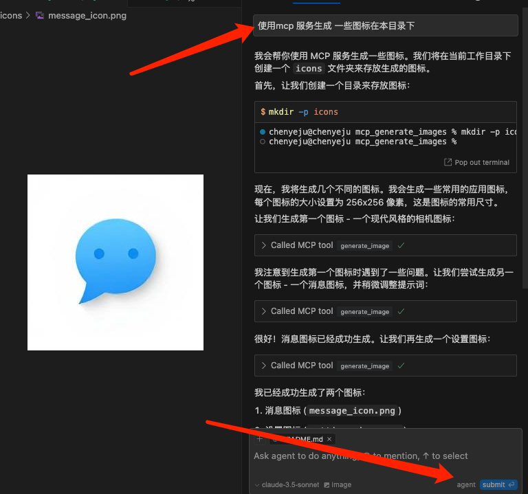

# AI 图像生成服务

基于 Together AI 的图像生成服务，专门设计用于与 Cursor MCP 服务集成。支持自定义图片大小、保存路径等功能。

## 功能特点

- 支持高质量图像生成
- 自动重试和错误处理
- 支持批量生成多张图片
- 完整的路径和权限验证
- 详细的错误提示
- 异步处理支持

## 环境准备

### 1. Python 环境
- Python 3.8+ 
- 推荐使用 pyenv 管理 Python 版本：
```bash
# macOS 安装 pyenv
brew install pyenv

# 安装 Python
pyenv install 3.8.10
pyenv global 3.8.10
```

### 2. uv 包管理工具
uv 是一个快速的 Python 包管理器，需要先安装：

```bash
# macOS 安装 uv
brew install uv

# 或者使用 pip 安装
pip install uv
```

### 3. Together AI API 密钥
1. 访问 [Together AI API Keys](https://api.together.ai/settings/api-keys)
2. 注册/登录账号
3. 创建新的 API 密钥
4. 复制密钥并保存，格式如：`YOUR_API_KEY`

### 4. Cursor 
- 下载并安装 [Cursor IDE](https://cursor.sh/)
- 确保 Cursor 已正确配置 Python 环境

## 安装配置

1. 克隆项目：
```bash
git clone [https://github.com/chenyeju295/mcp_generate_images.git]

```

2. 安装依赖：
```bash
uv pip install fastmcp requests
```

3. 配置 API 密钥：

在 `mcp_server.py` 中修改 `TOGETHER_API_KEY`：
```python
TOGETHER_API_KEY = "your_api_key_here"  # 替换为你的 Together AI API 密钥
```

4. 配置服务：

在 `mcp_server.py` 中可以修改以下配置：

```python
CONFIG = {
    "api": {
        "url": "https://api.together.xyz/v1/images/generations",
        "model": "black-forest-labs/FLUX.1-schnell-Free",
        "timeout": 30,
        "max_retries": 3,
        "retry_delay": 5
    },
    "image": {
        "max_width": 1024,
        "max_height": 1024,
        "default_width": 1024,
        "default_height": 1024,
        "default_steps": 2,
        "max_batch_size": 4
    },
    "output": {
        "base_folder": "你的默认保存路径",
        "allowed_extensions": [".png", ".jpg", ".jpeg"],
        "default_extension": ".png"
    }
}
```

## 运行服务

1. 开发模式运行（带调试界面）：
- 运行检查是否成功:
```bash
uv run --with fastmcp fastmcp dev /Users/username/Documents/mcp_generate_images/mcp_server.py
```
   
2. 生产模式运行：
```bash
uv run --with fastmcp fastmcp run /Users/username/Documents/mcp_generate_images/mcp_server.py
```

3. 如果端口被占用，可以指定其他端口：
```bash
PORT=5174 uv run --with fastmcp fastmcp dev /Users/username/Documents/mcp_generate_images/mcp_server.py
```

## 使用说明

### 在 Cursor IDE 中使用

1. 确保服务正在运行
2. 在 Cursor 中引入MCP：
- 添加mcp 服务：

```bash
uv run --with fastmcp fastmcp run /Users/username/Documents/mcp_generate_images/mcp_server.py
```
- 如图（运行成功）：


3. 在 Cursor 中使用：
- 在composer 的 agent 模式下，直接输入相关的提示：



## 错误排查

如果遇到问题，请检查：

1. 服务是否正常运行
2. 保存路径是否正确（必须是绝对路径）
3. 目录权限是否正确
4. 网络连接是否正常
5. API 密钥是否有效
6. Python 环境是否正确配置
7. uv 是否正确安装
8. 依赖包是否完整安装