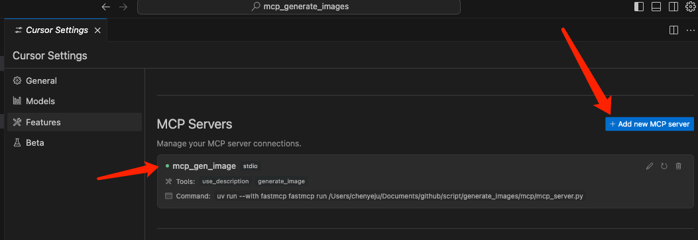

# AI Image Generation Service

An image generation service based on Together AI, specially designed to integrate with Cursor IDE. Supports customizing image aspect ratios, save paths, and provides high-quality image generation capabilities.

## Features

- High-quality image generation
- Multiple common aspect ratios (1:1, 4:3, 16:9, 3:4, 9:16)
- Adjustable generation steps to balance quality and speed
- Automatic retry and detailed error handling
- Batch image generation
- Complete path and permission validation
- Detailed error messages and logging
- Asynchronous processing

## Environment Setup

### 1. Python Environment

- Python 3.10+
- Download: <https://www.python.org/downloads/>

- Recommended: Use pyenv to manage Python versions:

```bash
# Install pyenv on macOS
brew install pyenv

# Install Python
pyenv install 3.13.2
pyenv global 3.13.2
```

### 2. Node.js Environment

- Download: <https://nodejs.org/en>  

### 3. UV Package Manager

UV is a fast Python package manager:

```bash
# Install UV on macOS
brew install uv

# Or install with pip
pip install uv
```

### 4. Together AI API Key

1. Visit [Together AI API Keys](https://api.together.ai/settings/api-keys)
2. Register/login
3. Create a new API key
4. Copy and save the key in the format: `YOUR_API_KEY`

### 5. Cursor

- Download and install [Cursor IDE](https://cursor.sh/)
- Ensure Cursor is correctly configured with Python

## Installation and Configuration

### 1. Clone the project

```bash
git clone https://github.com/chenyeju295/mcp_generate_images.git
cd mcp_generate_images
```

### 2. Install dependencies (cd to mcp_generate_images directory first)

```bash
python3 -m pip install fastmcp requests
```

If you encounter certificate issues, try:

```bash
python3 -m pip install fastmcp requests --trusted-host pypi.org --trusted-host files.pythonhosted.org --upgrade --force-reinstall --no-cache-dir
```

Tip: Ensure installation is successful, otherwise MCP service configuration will show errors.

### 3. Configure API key

Modify `TOGETHER_API_KEY` in `mcp_server.py`:

```python
TOGETHER_API_KEY = "your_api_key_here"  # Replace with your Together AI API key
```

### 4. Configure service

You can modify the following settings in `mcp_server.py`:

```python
CONFIG = {
    "api": {
        "url": "https://api.together.xyz/v1/images/generations",
        "model": "black-forest-labs/FLUX.1-schnell-Free",
        "timeout": 60,
        "max_retries": 3,
        "retry_delay": 5
    },
    "image": {
        "max_width": 1024,
        "max_height": 1024,
        "default_width": 1024,
        "default_height": 1024,
        "default_steps": 3,
        "max_batch_size": 4
    },
    "output": {
        "base_folder": "your_default_save_path",
        "allowed_extensions": [".png", ".jpg", ".jpeg"],
        "default_extension": ".png"
    }
}
```

## Running the Service

Run in development mode (with debugging interface):

```bash
uv run --with fastmcp fastmcp dev /Users/username/Documents/mcp_generate_images/mcp_server.py
```

## Using in Cursor

### 1. Add the MCP service to Cursor

Add to Cursor's MCP configuration:

```json
{
  "mcpServers": {
    "generate_images": {
      "command": "uv",
      "args": [
        "run",
        "--with",
        "fastmcp",
        "fastmcp",
        "run",
        "/Users/username/Documents/mcp_generate_images/mcp_server.py"
      ]
    } 
  }
}
```

### 3. Example of successful service running



### 4. Using in Cursor Composer's agent mode


## Parameter Description

The image generation tool supports the following parameters:

| Parameter Name | Type | Required | Description |
|---------------|------|----------|-------------|
| prompt | string | yes | Image generation prompt, recommended to be under 500 characters |
| file_name | string | yes | Filename to save (without path, defaults to .png if no extension) |
| save_folder | string | yes | Absolute path to save directory |
| aspect_ratio | string | no | Image aspect ratio, supports '1:1', '4:3', '16:9', '3:4', '9:16'. Default is '1:1' |
| steps | number | no | Number of inference/sampling steps, supports values 1-4, default is 3. More steps produce higher quality but take longer |

## Usage Example

```
Generate a landscape image with 16:9 aspect ratio, using 2 steps for faster generation:

generate_image(
  prompt="A beautiful mountain landscape with sunset", 
  file_name="landscape.png", 
  save_folder="/Users/username/Documents/images", 
  aspect_ratio="16:9", 
  steps=2
)
```

## Usage Notes

1. **Size Limitation**: The model (FLUX.1-schnell-Free) supports a maximum size of 1024x1024.
2. **Aspect Ratio**: Using a 1:1 aspect ratio (square image), such as 512x512 or 1024x1024, is recommended for best results and generation speed.
3. **Prompts**: Simple and clear prompts usually produce better results. Try to keep them under 500 characters.
4. **Timeout Issues**: Complex prompts or non-square images may take longer to generate and sometimes result in timeout errors.
5. **Steps Selection**:
   - steps=1: Fastest speed, lowest quality
   - steps=2: Balance between speed and quality
   - steps=3: Default value, good quality
   - steps=4: Highest quality, slowest speed

## Troubleshooting

If you encounter issues, check:

1. Whether the service is running properly
2. If the save path is correct (must be an absolute path)
3. Directory permissions
4. Network connection
5. API key validity
6. Python environment configuration
7. UV installation
8. Dependency package installation

## Common Errors and Solutions

| Error Message | Possible Cause | Solution |
|--------------|--------------|----------|
| "Failed to generate image: API request timeout" | Network issues or long processing time | Try reducing the steps value or using simpler prompts |
| "Failed to generate image: API rate limited" | Together API frequency limits | Wait a few minutes and try again |
| "Failed to generate image: API authentication failed" | Invalid API key | Check and update your API key |
| "No permission to save image to..." | Directory permission issues | Ensure the directory exists and has write permissions |
| "steps parameter must be between 1-4" | steps parameter out of range | Use a value between 1-4 |
| "Unsupported aspect ratio" | Using an unsupported aspect ratio | Use supported ratios: '1:1', '4:3', '16:9', '3:4', '9:16' | 